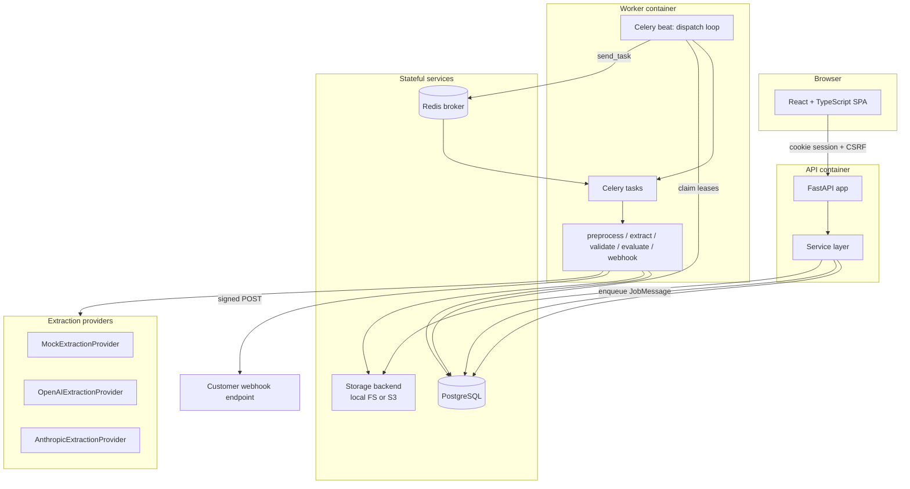

# DocIntel Bench

[](https://github.com/Adityaj54/docintel-bench/actions/workflows/ci.yml)

A document intelligence evaluation platform. Upload PDFs and images, define the JSON
structure you expect to get back, run extraction through pluggable LLM providers, validate
the output against your schema, score it against trusted ground truth, and compare runs on
accuracy, latency and cost.

The whole stack runs locally with `docker compose up --build` and requires **no external API
credentials** — a deterministic mock provider stands in for OpenAI and Anthropic.

---

## Why this exists

Teams evaluating document extraction usually end up with a pile of ad-hoc notebooks: one
script to call a provider, another to eyeball the JSON, a spreadsheet for accuracy. That
makes it hard to answer basic questions — did the new model actually get better, which
fields regress, what does a run cost.

DocIntel Bench makes each of those a first-class object: schemas are versioned, runs are
immutable snapshots of provider configuration, and every result carries its raw response,
validation errors, latency, token usage and evaluation score.

---

## Architecture



### Layering

Route handlers stay thin. They parse and authorize, then delegate:

| Layer | Location | Responsibility |
|---|---|---|
| API | `backend/app/api/` | Routing, request/response models, pagination, auth dependencies |
| Schemas | `backend/app/schemas/` | Pydantic request/response contracts |
| Services | `backend/app/services/` | Business rules, ownership checks, transaction boundaries |
| Domain modules | `evaluation/`, `normalization/`, `preprocessing/`, `validation/`, `webhooks/`, `metrics/`, `exports/`, `audit/` | Pure-ish logic, independently testable |
| Jobs | `backend/app/jobs/` | Durable queue, dispatch, retry policy, stage handlers |
| Providers | `backend/app/providers/` | Extraction adapters behind one interface |
| Storage | `backend/app/storage/` | Filesystem / S3 abstraction with key validation |
| Models | `backend/app/models/` | SQLAlchemy ORM, UUID primary keys |

### Domain entities

`User`, `Project`, `ExtractionSchema`, `Dataset`, `Document`, `ProviderConfiguration`,
`ExtractionRun`, `ExtractionResult`, `ValidationResult`, `GroundTruth`, `EvaluationResult`,
`AuditLog`, `WebhookConfiguration`, `WebhookDelivery`, plus `JobMessage` backing the durable
queue. All use UUID primary keys with real foreign-key relationships.

---

## Local setup

Requirements: Docker and Docker Compose. Nothing else — Python, Node, PostgreSQL and Redis
all live in containers.

```bash
cp .env.example .env      # placeholders only; blank secrets are generated locally
make dev                  # docker compose up --build
```

| Service | URL |
|---|---|
| Frontend | http://localhost:3000 |
| API | http://localhost:8000/api |
| OpenAPI docs (Swagger) | http://localhost:8000/docs |
| OpenAPI schema | http://localhost:8000/openapi.json |
| ReDoc | http://localhost:8000/redoc |
| Liveness | http://localhost:8000/api/health |
| Readiness (DB + Redis + storage) | http://localhost:8000/api/health/ready |

Register a user in the UI. With `SEED_ON_REGISTER=true` (the default) each new account gets
its own seeded invoice project — schema, dataset, sample documents and a completed mock run —
so the dashboard, metrics and comparison screens have data immediately. Seed data is
per-account; no shared credentials or shared fixtures.

To seed an existing account manually:

```bash
make seed          # docker compose exec api python -m app.cli.seed
```

Other targets:

```bash
make test          # pytest + vitest
make lint          # ruff + tsc --noEmit
make migrate       # alembic upgrade head
make stop          # docker compose down
make reset-db CONFIRM=yes   # destroys volumes, rebuilds from empty
```

---

## Environment configuration

All configuration is environment-based (`backend/app/core/config.py`, a Pydantic
`BaseSettings`). `.env.example` contains placeholders only; `.env` is gitignored. **No secret
is ever stored in the database.**

| Variable | Default | Notes |
|---|---|---|
| `DATABASE_URL` | `postgresql+psycopg://docintel@postgres:5432/docintel` | |
| `REDIS_URL` | `redis://redis:6379/0` | Celery broker |
| `SECRET_KEY` | *(blank)* | Session signing key. Blank generates one in a `0700` directory on the app volume; **required** and ≥32 chars when `ENVIRONMENT=production` |
| `COOKIE_SECURE` | `false` | Set `true` behind HTTPS |
| `SESSION_HOURS` | `24` | 1–168 |
| `ALLOWED_ORIGINS` | `http://localhost:3000,http://localhost:8000` | CORS allowlist |
| `STORAGE_BACKEND` | `local` | `local` or `s3` |
| `STORAGE_ROOT` | `/data/documents` | Local backend root |
| `S3_BUCKET` / `S3_ENDPOINT_URL` / `S3_REGION` | *(blank)* / *(blank)* / `us-east-1` | S3 backend; credentials come from the standard AWS chain |
| `MAX_UPLOAD_BYTES` | `26214400` (25 MB) | Enforced by middleware *and* the upload service |
| `MAX_PDF_PAGES` | `30` | |
| `RENDER_DPI` | `120` | PDF page rasterization, 72–200 |
| `MAX_IMAGE_DIMENSION` / `MAX_IMAGE_PIXELS` | `1800` / `30000000` | Decompression-bomb guard |
| `MAX_RUN_DOCUMENTS` | `100` | Per-run cap |
| `PROVIDER_TIMEOUT_SECONDS` | `90` | |
| `JOB_LEASE_SECONDS` | `300` | Lease before a stalled job is reclaimed |
| `JOB_MAX_ATTEMPTS` | `4` | Transient-error retry ceiling |
| `OPENAI_API_KEY` / `ANTHROPIC_API_KEY` | *(blank)* | Blank ⇒ that provider reports unavailable; mock still works |
| `WEBHOOK_SIGNING_KEY` | *(blank)* | Required to enable webhook delivery |
| `WEBHOOK_ALLOWED_HOSTS` | *(blank)* | Explicit hostname allowlist — SSRF guard |
| `WEBHOOK_ALLOW_PRIVATE` | `false` | Only for local testing; permits HTTP and private IPs |
| `SEED_ON_REGISTER` | `true` | Per-account demo data |

---

## Database migrations

Alembic, versioned under `backend/alembic/versions/`. The API container runs
`alembic upgrade head` on startup, so a fresh PostgreSQL volume migrates automatically.

```bash
make migrate                                              # upgrade head
docker compose run --rm api alembic downgrade -1          # reversible
docker compose run --rm api alembic revision --autogenerate -m "message"
```

Migrations are reversible — every `upgrade` has a real `downgrade`. Verify against an empty
database with `make reset-db CONFIRM=yes`.

---

## Worker and job architecture

Celery alone is at-most-once from the caller's perspective: if the process dies between the
database commit and the broker publish, the work is lost. So jobs are **written to PostgreSQL
first**, in the same transaction as the state change that caused them.

1. A service calls `enqueue(db, kind, entity_id, dedupe_key=...)`, inserting a `JobMessage`
   row in the caller's transaction. A unique `dedupe_key` makes enqueueing idempotent —
   re-requesting work that is already pending returns the existing row.
2. Celery beat runs `docintel.dispatch` on a loop. It claims due messages with
   `SELECT ... FOR UPDATE SKIP LOCKED`, stamps a lease (`JOB_LEASE_SECONDS`), and publishes
   to Redis. If the broker publish fails, the row is returned to `pending` — never lost.
3. The stage task re-loads the message under a row lock, checks the lease (so a duplicate
   delivery is a no-op), increments `attempts`, and runs the handler.
4. Messages whose lease expires while `dispatched`/`running` are reclaimed by the next
   dispatch pass, which is what makes a worker crash recoverable.

Stages: `preprocess` → `extract` → `validate` → `evaluate`, plus `webhook` for delivery.

**Retry policy** (`backend/app/jobs/runner.py`) distinguishes error classes:

- `TransientError` — rate limits, timeouts, provider 5xx — retries with exponential backoff
  (`min(300, 2**attempt)` seconds) up to `JOB_MAX_ATTEMPTS`.
- `DomainError` — invalid schema, missing file, unsupported document — is **terminal**.
  Retrying cannot help, so the result is failed immediately with a stable error code.

**Partial failure is first-class.** Each document is its own `ExtractionResult` with its own
job. One document failing marks that result `failed` and the run `partially_failed`; the rest
continue. A run only becomes `failed` when every document failed.

---

## Storage architecture

`StorageBackend` (`backend/app/storage/base.py`) is a five-method ABC: `put`, `get`,
`delete`, `exists`, `access_url`. `get_storage()` selects the implementation from
`STORAGE_BACKEND`.

- `LocalStorageBackend` — filesystem, used by Compose. `access_url` returns `None`, so the
  API streams bytes itself.
- `S3StorageBackend` — boto3, credentials from the standard AWS chain. `access_url` returns
  a presigned URL.

Every key passes `validate_key()` before touching a backend: no absolute paths, no `..`
segments, no backslashes, no NUL bytes, 500-char ceiling, and the key must round-trip
through `PurePosixPath` unchanged. Uploaded filenames never become storage keys — keys are
derived server-side — which is what closes the path-traversal hole.

Originals and rendered page artifacts are both stored through this interface, so switching
to S3 is a single environment variable.

---

## Provider architecture

One interface, in `backend/app/providers/base.py`:

```python
class ExtractionProvider(ABC):
    @abstractmethod
    def extract(self, request: ProviderInput) -> ProviderOutput: ...
```

`ProviderInput` carries the document hash, filename, target JSON Schema, rendered page bytes,
extracted text, model name and free-form options. `ProviderOutput` carries the parsed
content, the **raw** provider response, token counts and estimated cost.

| Provider | Credentials | Behaviour |
|---|---|---|
| `mock` | none | Deterministic output derived from document hash + schema. Always available. |
| `openai` | `OPENAI_API_KEY` | Real adapter; reports unavailable when unset. |
| `anthropic` | `ANTHROPIC_API_KEY` | Real adapter; reports unavailable when unset. |

`GET /api/projects/{id}/providers` exposes availability so the UI can disable unconfigured
options rather than failing at run time. API keys live in environment variables only — a
`ProviderConfiguration` row stores the model and options, never a secret.

### Adding a provider

1. Create `backend/app/providers/yourprovider.py` with a class implementing
   `ExtractionProvider.extract`.
2. Convert failures into the shared error vocabulary: raise `TransientError` for rate limits
   and timeouts (retryable), `DomainError` for auth failures and malformed output (terminal).
   `backend/app/providers/http.py` has helpers for mapping status codes.
3. Return the untouched provider response in `ProviderOutput.raw`, and use
   `estimate_cost(input_tokens, output_tokens, options)` for cost.
4. Register it in `PROVIDERS` in `backend/app/providers/registry.py` and add an availability
   entry in `provider_availability()`.
5. Add a settings field for its key in `core/config.py` and a placeholder in `.env.example`.

No changes to routes, jobs or the UI are required — the registry is the only coupling point.

---

## How extraction works end to end

1. **Upload.** Content type, MIME/extension agreement, size and emptiness are checked. A
   SHA-256 content hash blocks duplicates *within a dataset*. Metadata recorded: original
   filename, MIME type, size, hash, storage key, page count, dimensions, status.
2. **Preprocess.** PDFs: page count enforced against `MAX_PDF_PAGES`, pages rendered at
   `RENDER_DPI` and stored as artifacts. Images: dimensions inspected, EXIF orientation
   normalized, oversized images resized. Encrypted PDFs and animated images are rejected with
   specific codes.
3. **Run.** A run snapshots provider, model and options at creation, so later configuration
   edits never rewrite history. Statuses: `queued`, `running`, `completed`,
   `partially_failed`, `failed`, `cancelled`.
4. **Normalize.** Provider text goes through `normalization/service.py` before validation:
   markdown code fences stripped, up to three levels of `{"data": …}`-style wrapper objects
   unwrapped, numeric strings coerced, `NaN`/`Infinity` rejected. Every transformation is
   recorded as a warning; malformed JSON raises `MALFORMED_PROVIDER_JSON` rather than being
   silently dropped. The raw response is always preserved.
5. **Validate.** The normalized value is checked against the schema version selected for the
   run. Each error carries a JSON Pointer path, validator/keyword, expected type/value,
   received type/value where available, and a readable message.
6. **Evaluate.** If the document has ground truth, the result is scored against it.

---

## How evaluation works

`backend/app/evaluation/compare.py` walks expected and actual in parallel and emits one row
per leaf, each labelled `match`, `changed`, `missing`, `extra` or `type_mismatch`, with a
JSON Pointer to both sides. The UI renders these directly as the diff view.

Matching is configurable per run (`EvaluationOptions`):

| Option | Default | Effect |
|---|---|---|
| `normalize_strings` | `true` | NFKC normalization + whitespace collapse |
| `case_sensitive` | `false` | Case-folded string comparison |
| `numeric_tolerance` | `0.01` | Absolute tolerance |
| `relative_tolerance` | `0` | Relative tolerance (`math.isclose`) |
| `array_order` | `ordered` | `unordered` matches array elements by best fit |
| `ignore_extra_fields` | `false` | Exclude `extra` rows from scoring |

With `array_order: unordered`, elements are paired by **minimum-cost assignment**
(`evaluation/assignment.py`) using per-element mismatch ratio as cost — so reordered line
items score correctly instead of cascading into an all-fields-wrong diff.

Scores reported: `precision` (matched ÷ predicted), `recall` (matched ÷ trusted), `f1`, and a
flat `score` (matched ÷ total scored fields). Ground truth is versioned; editing it creates a
new version and schedules re-evaluation of affected results, with the change written to the
audit log.

---

## Running tests

```bash
make test
# or individually:
docker compose run --rm --no-deps api pytest
docker compose run --rm --no-deps frontend npm test -- --run
```

Coverage: `docker compose run --rm --no-deps api pytest --cov=app`.

Linting and type checks: `make lint` (ruff over `app` and `tests`, `tsc --noEmit` for the
frontend, which builds under TypeScript `strict`).

### Continuous integration

`.github/workflows/ci.yml` runs on every push to `main` or `develop` and on every pull
request, in four parallel jobs:

| Job | What it guards |
|---|---|
| **backend** | `ruff check`, then the pytest suite with coverage |
| **frontend** | `tsc --noEmit` under `strict`, Vitest, and a production `vite build` |
| **migrations** | `upgrade head` from an empty PostgreSQL, `downgrade base`, `upgrade head` again, then an autogenerate run that fails if a model change has no migration |
| **stack** | `docker compose build` and `up`, waiting on `/api/health/ready` and the frontend, with container logs dumped on failure |

---

## API documentation

FastAPI generates it from the Pydantic models — Swagger UI at `/docs`, ReDoc at `/redoc`,
raw schema at `/openapi.json`. Every request and response body is a typed model; the
frontend mirrors them in `frontend/src/types/domain.ts`.

Errors share one envelope with a stable machine-readable code:

```json
{
  "error": {
    "code": "DUPLICATE_DOCUMENT",
    "message": "This document already exists in the dataset.",
    "details": {},
    "request_id": "..."
  }
}
```

Roughly 65 distinct codes are in use (`DUPLICATE_DOCUMENT`, `PDF_PAGE_LIMIT`,
`MALFORMED_PROVIDER_JSON`, `PROVIDER_NOT_CONFIGURED`, `WEBHOOK_HOST_NOT_ALLOWED`,
`REVISION_CONFLICT`, …), so clients branch on `code` and never on message text.

---

## Security considerations

**Authentication.** Argon2id password hashing (`time_cost=3`, `memory_cost=64 MiB`,
`parallelism=2`). Sessions are signed JWTs in an `HttpOnly`, `SameSite` cookie — never in
`localStorage`. Session IDs are tracked in Redis so logout and revocation take effect
immediately rather than waiting for expiry. State-changing requests require an `X-CSRF-Token`
header matched against the session, plus an origin check.

**Authorization.** Every project-scoped object is reached through `services/access.py`, which
re-checks ownership at the document, dataset, run and result boundary. Requesting another
user's object returns `NOT_FOUND`, not `FORBIDDEN`, so IDs cannot be enumerated.

**Uploads.** Type, MIME agreement, size and emptiness are validated; body size is capped by
middleware before the request is buffered. Pillow limits guard decompression bombs; encrypted
PDFs are rejected. Filenames never reach the filesystem — keys are server-generated and pass
`validate_key()`, which rejects absolute paths, `..`, backslashes and NUL bytes.

**Secrets.** Provider keys, the session key and the webhook signing key come from the
environment only, are never persisted to the database, and never appear in a response.
`.env` is gitignored; `.env.example` holds placeholders only. In production a `SECRET_KEY` of
at least 32 characters is mandatory — the app refuses to start without one.

**Webhooks.** Payloads are signed `HMAC-SHA256` over `timestamp . body` with a canonical JSON
encoding, sent as `sha256=…` with a timestamp header so receivers can reject replays;
`verify_signature` uses `hmac.compare_digest`. Destinations must appear in
`WEBHOOK_ALLOWED_HOSTS`, must be HTTPS, may not embed credentials, and are resolved with
every returned address checked to be globally routable — blocking SSRF against link-local and
private ranges. Delivery attempts are bounded and recorded.

**Logging.** Structured logs carry a request ID (echoed as `X-Request-ID`) and run/job
context. Credentials, cookies and authorization headers are excluded; unexpected exceptions
log the exception *type* and return a generic `INTERNAL_ERROR` so internals never leak to
clients.

**Database.** SQLAlchemy parameterizes all queries; UUID primary keys avoid enumerable
sequential IDs. PostgreSQL and Redis are published only on the Compose network, and the API
and frontend bind to `127.0.0.1`.
